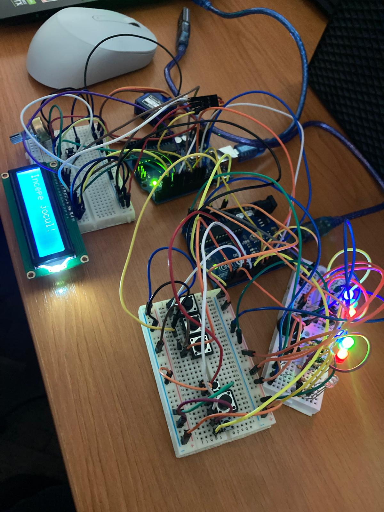
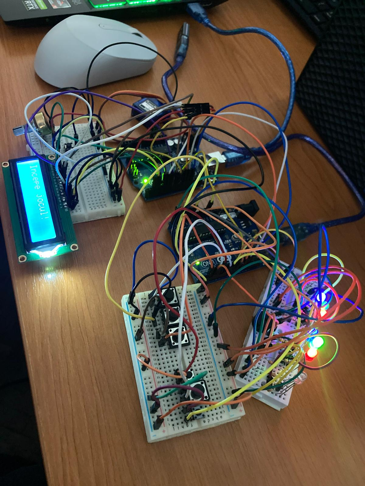
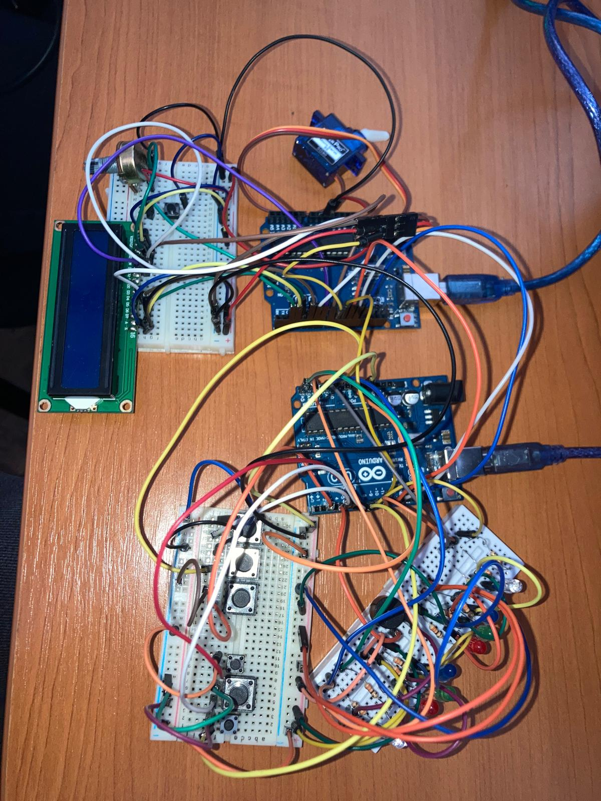
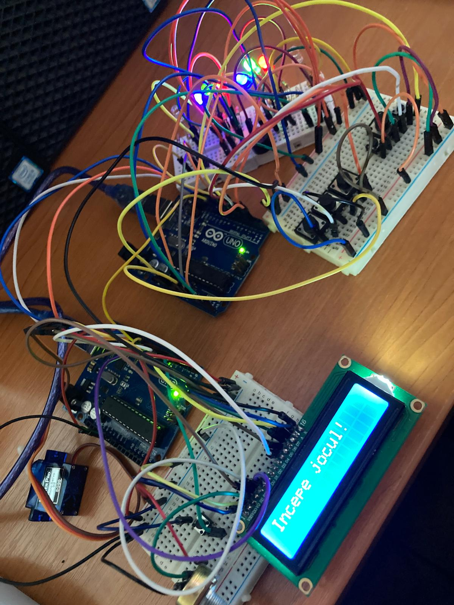
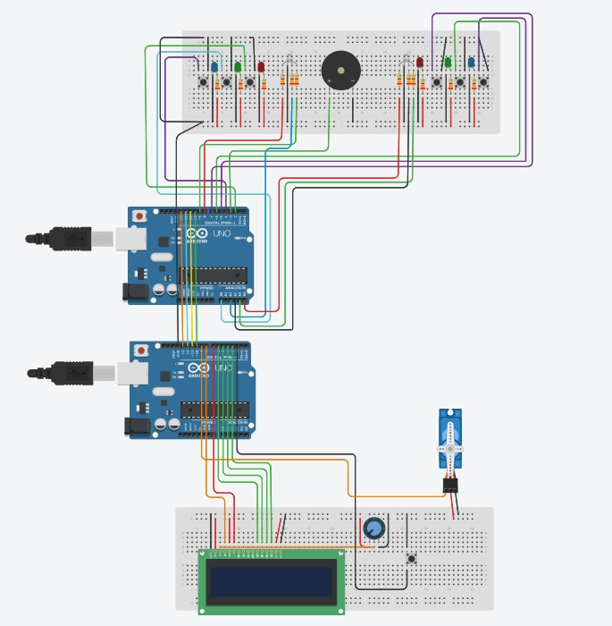
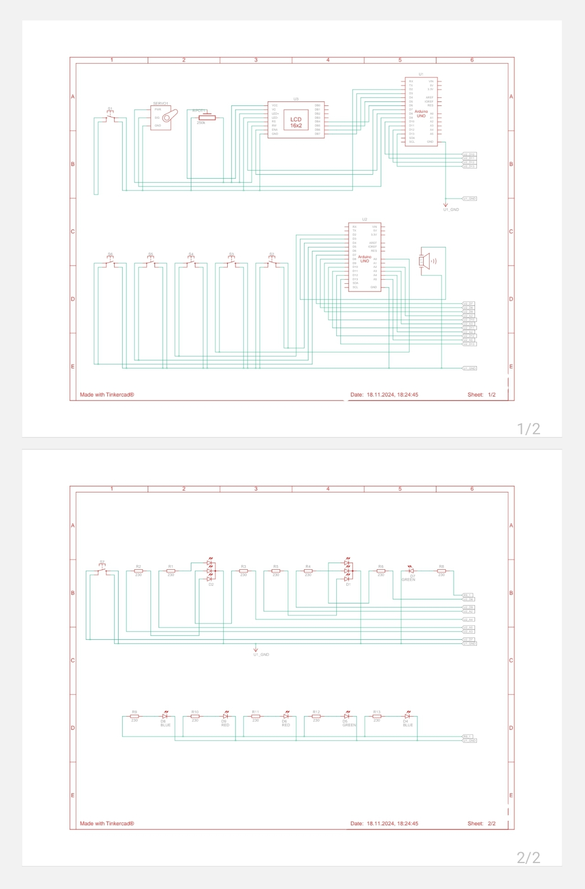

# Tema 3 - Quick Time

## Descrierea si flow-ul proiectului

Sistemul include două plăci Arduino care comunică prin SPI: una este master și coordonează jocul (LCD-ul, timerul cu servomotor și starea jocului), iar cealaltă este slave și gestionează inputurile și feedbackul vizual prin LED-uri.

Jocul se desfășoară pe rând, fiecare jucător având ca obiectiv să apese rapid butonul asociat culorii afișate pe LED-ul RGB(albastru, verde, rosu). Placa master trimite culoarea pentru fiecare tură, iar slave aprinde LED-ul corespunzător și așteaptă input. Scorul depinde de timpul de reacție: sub 0,3s, sub 0,6s sau sub 1s. Greșelile sau întârzierea peste 1s duc la 0 puncte, iar un buzzer semnalează erorile.

La final, master calculează scorurile, anunță câștigătorul și revine la meniul principal pentru un nou joc.

Pe tot parcursul jocului display-ul LCD va arata punctajul fiecarui jucator.

## Componente utilizate

- 6x LED-uri (2 grupuri de câte 3 leduri: albastru, verde si rosu)
- 2x LED RGB (1 pentru fiecare jucător)
- 12x Rezistențe 330 ohm
- 7x Butoane (3 pentru fiecare jucător + 1 pentru pornirea jocului)
- 1x LCD
- 1x Potențiometru
- 1x Servomotor
- 2x Breadboard
- Fire de legătură
- 2x Arduino Uno

## Poze ale setup-ului fizic

## Video cu functionalitatea montajului fizic

https://youtu.be/-a_K9zLdSlE?si=ClWI5_-FjgzcEhGD

## Schema electrica

